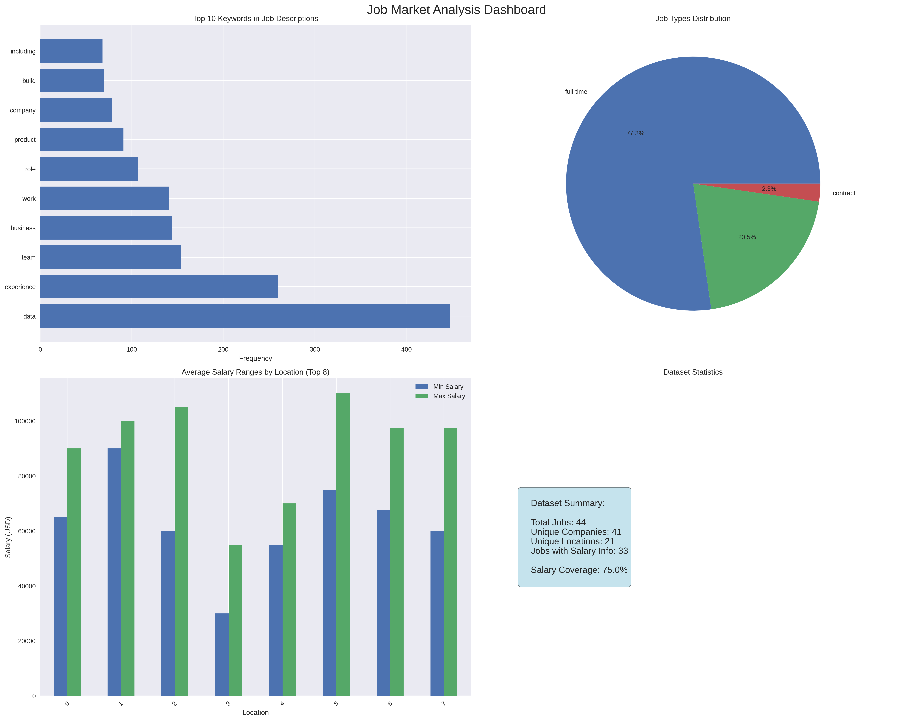

<h1 style="text-align: center;"> 📊 Data Career Insights: Job Market Analysis Engine </h1>

*<h4 style="text-align: center;"> Because who doesn't want to know what the data job market really looks like? </h3>*

<h2 style="text-align: center;"> 1. 🚀 Project Overview </h2>

This project dives into the wild world of data job postings, scraping and analyzing opportunities across Data Science, Analytics, and Engineering roles. It uncovers salary differences, skill trends, and the stories behind those "5+ years experience for entry-level" postings we all love to hate.

### 1.1 🎯 What This Project Does

**The Fun Stuff:**
- **Web Scraping Magic**: Automatically harvests job postings from popular job boards (because manually copying job descriptions is an engineering abomination)
- **Data Cleaning Wizardry**: Transforms messy job posting chaos into pristine, analysis-ready datasets
- **Smart Analytics**: Extracts meaningful patterns from the noise of corporate job-speak
- **Visual Storytelling**: Creates compelling charts and reports that actually make sense
- **Trend Spotting**: Identifies which skills are hot, which are not, and which might get you that dream salary

**The Business Value:**
- Regional demand analysis for strategic career planning
- Salary benchmarking across industries and experience levels
- Early detection of emerging technologies and skill requirements
- Evidence-based recommendations for job seekers and hiring managers
- Historical trend analysis for workforce planning
- Educational curriculum insights for training programs
- Enhanced datasets for further research and analysis

<h2 style="text-align: center;">2. 🛠️ Technical Architecture </h2>

### 2.1 Core Components

```
📁 analysis/               # The insights factory
├── analyzers.py           # Statistical analysis modules for job postings data.
├── exporters.py           # Output formatting and delivery
└── visualizers.py         # Chart and report generators

📁 config/                 # Configuration management
└── config.yaml            # Data Jobs Analysis Configuration

📁 data/                   # The treasure chest
├── raw/                   # Unprocessed job postings
├── processed/             # Clean, analysis-ready datasets
└── outputs/               # Reports and visualizations

📁 scraper/                # The data collection engine
├── __init__.py            # Job scraping module for data career job postings analysis.
├── base_scraper.py        # Base scraper class and common utilities for job data collection.
├── coordinator.py         # Coordinator for managing multiple job board scrapers.
├── jobicy_scraper.py      # Jobicy job board scraper implementation.
└── remoteok_scraper.py    # RemoteOK job board scraper implementation.

── analyze_jobs.ipynb      # Interactive analysis playground
```

### 2.2 Key Technologies
- **Python 3.12+**: The backbone of our operation
- **BeautifulSoup**: For web scraping excellence
- **Pandas/NumPy**: Data manipulation workhorses
- **Matplotlib/Seaborn**: Visualization powerhouses
- **Jupyter**: Interactive analysis environment

<h2 style="text-align: center;"> 3. 🚦 Getting Started </h2>

### 3.1 Prerequisites
- Python 3.12 or higher
- Basic understanding of data analysis (helpful but not required)
- A snack and/or preferred beverage (essential)

### 3.2 Installation

1. Clone the repository:
    ```bash
    git clone https://github.com/czemtsop/data-jobs.git
    cd data-jobs
    ```
2. **Set up your environment:**
   ```bash
   # Using uv (recommended)
    uv sync 
    ```

3. **Configure your settings:**
   ```bash
   # Replace the config.yaml file with your preferences (config_example.yaml)
   cp config/config_example.yaml config/config.yaml
   ```

### 3.3 Quick Start Options

**Option 1: Interactive Analysis (Recommended for beginners)**

Use the [analyze_jobs](analyze_jobs.ipynb) jupyter notebook
```bash
jupyter notebook analyze_jobs.ipynb
```

**Option 2: Command Line Power User**
```bash
python main.py
```

**Option 3: Custom Analysis** Import modules individually for specific tasks

<h2 style="text-align: center;"> 4. 📈 What You'll Discover </h2>

### 4.1 Sample Insights Generated




<h2 style="text-align: center;"> 5. 🔧 Configuration & Customization </h2>

### Scraping Configuration
```yaml
scrapers:
  jobicy:
    enabled: true
    delay: 10  # Be nice to their servers
    max_pages: 50
  remoteok:
    enabled: true
    delay: 10  # We're that considerate
  jooble:
    enabled: false  # Requires authentication
    
filters:
  job_titles: ["Data Scientist", "Data Engineer", "Data Analyst"]
  locations: ["Remote", "Canada"]
  experience_levels: ["Entry", "Mid", "Senior", "Executive"]
```

### Analysis Parameters
```yaml
text_processing:
  custom_stopwords: ['across', 'help', 'skills', 'will', 'job', 'work', 'team', 'company']
  max_words_wordcloud: 30
  top_keywords_count: 20

analysis:
  salary_outlier_threshold: 3
  minimum_job_count: 10
  trend_analysis_days: 90

output:
  data_dir: "data"
  raw_dir: "data/raw"
  processed_dir: "data/processed"
  reports_dir: "data/outputs"
  
visualization:
  wordcloud:
    width: 800
    height: 400
    background_color: 'white'
    contour_color: 'steelblue'
    contour_width: 1
  
  charts:
    figsize: [12, 6]
    style: 'seaborn-v0_8'
```

<h2 style="text-align: center;"> 6. 🚧 Current Limitations & Workarounds </h2>

**What We're Working On:**
- **Rate Limiting**: Most job boards don't appreciate web scraping (we're implementing smarter delays)
- **Data Standardization**: Job titles are... creative ("Computational journalist" is apparently a real thing)
- **Geographic Normalization**: "Remote" sometimes needs a passport.

**Known Issues:**
- Salary parsing struggles with "competitive salary" (shocking, we know)
- Job location tagging needs refinement

<h2 style="text-align: center;"> 7. 🔮 Exciting Future Enhancements </h2>

### 7.1 Phase 2: Expansion Pack
- **Multi-Platform Scraping**: Indeed, Glassdoor, LinkedIn, AngelList, Stack Overflow Jobs
- **Network Analysis**: Company hiring patterns and employee movement
- **Crowdsourced Insights**: Community-contributed salary and interview data

<h2 style="text-align: center;"> 8. 🤝 Contributing </h2>

We love contributors! Whether you're fixing typos, adding features, or sharing insights:

1. **Fork the repository**
2. **Create a feature branch**: `git checkout -b feature/amazing-addition`
3. **Make your changes**
4. **Submit a pull request**

### Contribution Ideas
- Add new job board scrapers
- Improve data cleaning algorithms
- Create new visualization types
- Write documentation (always appreciated!)
- Share interesting analysis findings

<h2 style="text-align: center;"> 9.🛡️ Data Privacy & Ethics </h2>

We take data responsibility seriously:
- **Public Data Only**: We only scrape publicly available job postings
- **Respectful Scraping**: Rate limiting and robots.txt compliance
- **Data Anonymization**: Personal information is never collected or stored
- **Transparent Methods**: All scraping and analysis code is open source


<h2 style="text-align: center;"> 10. 📄 License & Legal </h2>

This project is licensed under the GNU General Public License v3.0 - because knowledge should be free, but please give credit where it's due.

### Disclaimer
This tool is for educational and research purposes. Always respect website terms of service and be mindful of scraping policies. We're not responsible if you get banned from a job board for being too enthusiastic with the scraper (but we'll help you debug it).

---

*Built with ❤️ by data nerds, for data nerds. May your p-values be significant and your models converge.*